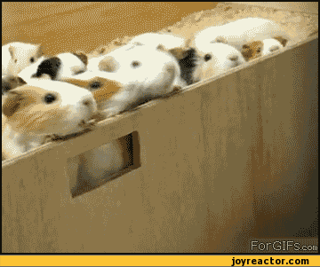

# ratpack-playground

In this exercise we will try to fix two broken tests to better understand Ratpack's execution model.

## Set up

`git clone https://github.com/albloptor/ratpack-playground.git`

## Exercise

### Case 1: promise refactoring
1. Fix the function sequentialRun to make this test work
2. Is the implementation correct? How can it be improved so that the test still passes?

Notes: 
- You can and probably should change method signatures and implementation of the production code, but you can't change the test code.

### Case 2: nested promises
1. Fix the function nestedRun to make this test work
